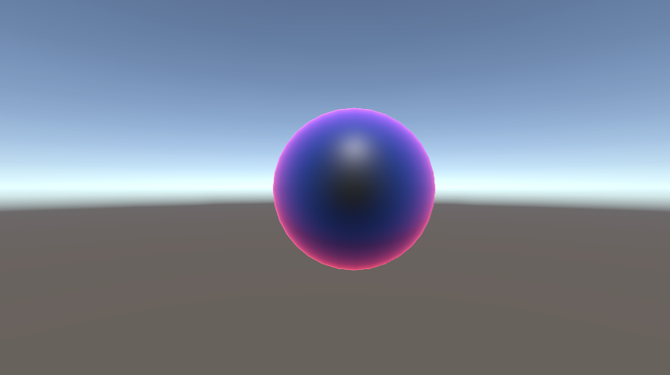
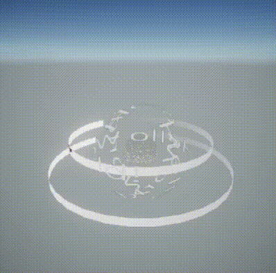
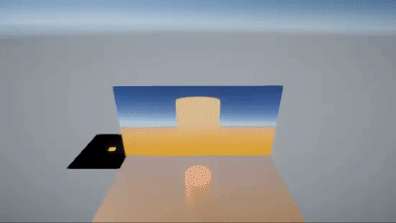

# これは何？
プログラムワークショップ4の管理用

# 使い方

- 本リポジトリ(tpu-game-2023/PGWS4)をforkしてください。
- fork先のリポジトリを更新してください
- 結果を画面キャプチャして、下記のリンクで見れるようにしてください
- 完成したら本リポジトリのmainブランチにpull requestを投げてください

# 結果

  

説明：赤から緑、緑から青、青から赤に色が変化するようにしました。

# 締め切り
次の授業の2日前（水曜日の授業であれば月曜日一杯）
